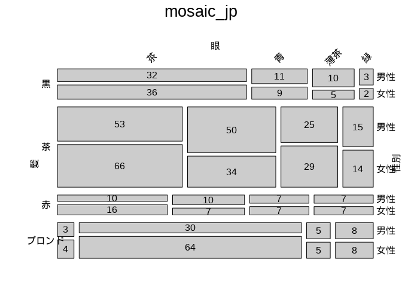

<!-- README.md is generated from README.Rmd. Please edit that file -->

# futools

このPackageは、vcdが提供するmosaic
などのグラフ生成ツールで日本語を使えるようにするものです。

カテゴリカルデータの可視化には、Michael
Friendly先生たちのvcd（その名もずばり、Visualizing of Categorical
Data：カテゴリカルデータの可視化）が有効なことはいろいろなところでこのパッケージが紹介されていることからもわかります。ただ、グラフィックがbase
graphics
ではなく、（latticeやggplot2でも使われている）gridであることもあり、日本語表示が簡単ではありませんでした。

~~しかし、gpar に日本語フォントを指定することでmosaicなどのvcd function
で日本語がつかえるようになります。~~

ggplot2 でも有効ですが、grid graphics
であるvcdで日本語を使うには、`package showtext`をインストールし、`library(showtext)`ののり、`showtext_auto(TRUE)`を設定すればOKです。

以前、以下のように書いてましたが、

「当初は、一々mosaic()の中にパラメータで書いていたのですが、さすがに面倒になったので、wrapper
をパッケージにしてみました。」

showtextを使えば日本語（以外もOK）表示のために、いちいちgparを指定しなくてもいいので、このwraperは、mosaiの使い方になりました。

Github からインストールできますので、使ってみてください。

## Installation

githubから以下のようにしてインストールできます：

``` r
# install.packages("devtools")
devtools::install_github("419kfj/futools")
```

## Example

This is a basic example which shows you how to solve a common problem:

``` r
library(vcd)
```

    ## 要求されたパッケージ grid をロード中です

``` r
library(RColorBrewer)
library(futools)
library(showtext)
```

    ## 要求されたパッケージ sysfonts をロード中です

    ## 要求されたパッケージ showtextdb をロード中です

``` r
showtext_auto(TRUE)

# data set
data(HairEyeColor_jp)

# plain mosaic_jp
mosaic_jp(HairEyeColor_jp)
```

<!-- -->

``` r
# without cell color
mosaic_jp2(HairEyeColor_jp)
```

<!-- -->

``` r
# set cell color by color matrix
cset <- t(matrix(rep(brewer.pal(4,"Blues"),2),ncol=2))
mosaic_jp2(HairEyeColor_jp,gp=gpar(fill=cset,col=0))
```

<!-- -->

``` r
# Pearson residulas
mosaic_jp2(HairEyeColor_jp,shade=TRUE)
```

<!-- -->

# 参考文献

- 藤本一男,2017, 「二つのmosaic plotと日本語表示」
  <https://www.slideshare.net/kazuofujimoto/2mosaic-plot-80084536>
- 藤本一男,2017, 「vcd/vcdExtra で日本語を使う その2」
  <https://www.slideshare.net/kazuofujimoto/use-japanese-with-vcdvcdextra-package>
- David Meyer, Achim Zeileis, Kurt Hornik , 2007, The Strucplot
  Framework: Visualizing Multi-way Contingency Tables with vcd, Journal
  of Statistical Software,Vol17,
  <https://www.jstatsoft.org/index.php/jss/article/view/v017i03/v17i03.pdf>
- Michael Friendly,2017, Working with categorical data with R and the
  vcd and vcdExtra packages,
  <https://cran.r-project.org/web/packages/vcdExtra/vignettes/vcd-tutorial.pdf>
